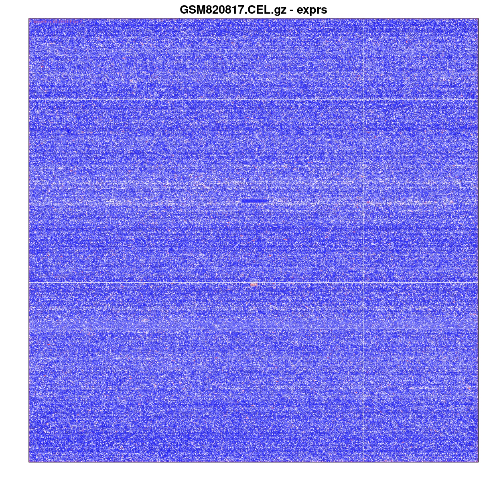

---
# Please do not edit this file directly; it is auto generated.
# Instead, please edit 02-DataImport-Oligo.md in _episodes_rmd/
title: "Importing raw microarray data into R (oligo package)"
teaching: 10
exercises: 20
source: Rmd
questions:
  - "Can you think of how you might read the CEL files in an order that is guaranteed to match the  desired order?"
  - "Can you describe the practical differences between GSM, GSE, and GDS data in GEO?"
objectives:
- Be able to obtain data from GEO, including processed and raw data.
- Be able to explain and use the differences between GEO data types.
- Understand the concept of the ExpressionSet class of objects.
keypoints: 
- GEO data types have enough similarities to allow data access, but enough differences to require specific type-specific steps.
- The function `read.celfiles()` is used to import raw CEL files into R for normalisation
  and analysis.
- The ExpressionSet class of object contains slots for different information associated
  with a microarray experiment. 
---

In the class, we learned how the basic requirements of a complete data object for gene expression
microaray studies consists of a tall, skinny matrix (for the experimental measurements) and a
short, wide table (to describe the experiment). The Bioconductor class for this type of data is an
`ExpressionSet`. For raw data from a platform such as Affymetrix, there are specific classes that
resemble ExpressionSet classes. 

In this lesson we will be creating these objects in R from data available at GEO.

## The ExpressionSet class 

The ExpressionSet class of objects are commonly used to store microarray experiment data. A typical ExpressionSet class object contains the following data: 

assayData
: raw or processed intensities, where each row corresponds to one probe and each column corresponds to one sample

phenoData
: experimental meta-data, where each row corresponds to one sample.

featureData
: This is optional annotation of the features (e.g., genes or transcripts) measured in an experiment.

annotation
: a character vector specifying the platform name 

> ## The data set
> 
> Data for this lesson is taken from GEO (accession ID: [GSE33146][GSE33146]).
> The experiment was on a cancer cell line grown in culture.
> Cells are grown in either MEGM (where they retain an epithelial phenotype) or SCGM
> (where they undergo reversible epithelial-mesencymal transition, or EMT). Gene 
> expression analysis using the [HG-U133_plus2][u133plus2] microarray was performed to identify genes
> associated with the EMT process.
{: .callout}

## Getting processed data from GEO into R

Before any analysis, we need to get the raw data into R. If you navigate to [GSE33146][GSE33146], you will see that several different file formats are available for download. We are looking for the supplemental files (the `.CEL` files) as well as some description of the experiment. 

> ## The GEO file types
>
> [SOFT][SOFT] files
> : The SOFT file format is commonly used by submitters to GEO. It contains a lot of information
>  about the experiment (MIAME compliance), and also contains the estimates for each gene or transcript, in a custom defined file format.
>
> [MINiML][MINIML] file
> : The MINiML file format uses XML, a computer-readable markup language. This has the same information 
>  as SOFT, but in a different format.
>
> Series matrix file
> : The matrix file is meant to be readable directly into a spreadsheet.
>  Generally these files don't have all the information provided by SOFT, but are easy to work with.
>
> Supplemental files
> : The `.CEL` files have the original, unprocessed data. 
>  Since we want to process it ourselves, that's what we'll need.
{: .checklist}

## Download the files or query them directly using GEOquery

The GEOquery package (definitely try `browseVignettes('GEOquery')`) provides tools for reading files directly from GEO based on the accession.
GEOquery works for different kinds of GEO data, including Samples (GSM), platforms (GPL), data sets, (GDS), and series (GSE). 

> ## These data appear complicated.
>
> GEOquery, like other Bioconductor packages, creates data objects that seem somewhat complicated.
> If you are used to simple R lists, vectors, and data frames, the data structures may seem
> overwhelming. Keep in mind that these data stuctures, regardless of how complicated they are, are
> basically compositions of data structures you already know: lists, vectors, matrices, and data
> frames.
{: .callout}

## Getting a single GSM object for a single sample

We can create a single GSM object with a call to getGEO (I'm using an example from the same GSE).

Note that setting GSEMatrix=FALSE will parse the SOFT file rather than the (potentially faster, but possibly error-prone) attempt to read the GSE matrix as an object.

~~~
library(GEOquery)
gsm <- getGEO('GSM820817',GSEMatrix=FALSE)
~~~
{: .language-r}

~~~
## What methods are available to call on this class of data?
methods(class=class(gsm))
~~~
{: .language-r}

~~~
[1] Accession Columns   dataTable Meta      show      Table    
see '?methods' for accessing help and source code
~~~
{: .output}

~~~
## The Table method shows the estimates
head(Table(gsm))
~~~
{: .language-r}

~~~
     ID_REF     VALUE
1 1007_s_at 11.502651
2   1053_at  9.861017
3    117_at  6.299005
4    121_at  8.632274
5 1255_g_at  3.721331
6   1294_at  7.376385
~~~
{: .output}

~~~
## The Meta method shows the experimental design, etc.
head(Meta(gsm))
~~~
{: .language-r}

~~~
$channel_count
[1] "1"

$characteristics_ch1
[1] "cell line: Human breast cancer-derived cell line DKAT"
[2] "culture medium: MEGM"                                 

$contact_address
[1] "MSRB Room 217, Research Dr."

$contact_city
[1] "Durham"

$contact_country
[1] "USA"

$contact_department
[1] "Pharmacology and Cancer Biology"
~~~
{: .output}
As you can see, the `Table` method returns numeric estimates for each probe (which is what we will eventually get after pre-processing), while the `Meta` method gives us information about our experiment.

> ## Why does this GSM appear in *two* series?
>
> One of the `Meta()` entries (`series_id`) shows that the sample from GSE33146 actual belongs to
> *two* series. What is the difference between them? 
>
> > ## Solution
> >
> > 
> > ~~~
> > Meta(gsm)[['series_id']]
> > ~~~
> > {: .language-r}
> > 
> > 
> > 
> > ~~~
> > [1] "GSE33146" "GSE33167"
> > ~~~
> > {: .output}
> > Look up GSE33167 on the GEO web site.
> > The series GSE33167 is a *super-series* composed of two series: the one we are looking at and another series comparing baseline expression among triple-negative breast cancer cell lines.
> {: .solution}
>
{: .challenge}

### Retrieving the Series parsed into a list of ExpressionSets

The GEO Series (the GSE) is the most complicated object retrieved by `getGEO()`, because a series is composed of sample (GSM) and platform (GPL) objects.  The basic use of `getGEO()` with a GSE accession will return a list of `ExpressionSet` objects, one for each platform. In the case of GSE33146, the entire data is on one platform, so the list only has one entry. _Nonetheless, if you want to access the ExpressionSet object, you must get the one and only entry of the list_. 

~~~
library(GEOquery)
## if we have a good connection to the internet, we can download it directly from GEO
## gse <- getGEO('GSE33146')
## If it's available on a local file system
##gse <- getGEO(filename='data/GSE33146_family.soft')
length(gse)
~~~
{: .language-r}

~~~
[1] 1
~~~
{: .output}

~~~
class(gse[[1]])
~~~
{: .language-r}

~~~
[1] "ExpressionSet"
attr(,"package")
[1] "Biobase"
~~~
{: .output}

### Retrieving the Series data directly

Sometimes you might want to access information from the SOFT file that is not contained in the ExpressionSet list returned by `getGEO()`. In other situations, the `getGEO()` function might cause an error in parsing the data. In those cases, you can retrieve the series without converting into a list of expressionSets by running `getGEO(...,GSEMatrix = FALSE)`, which returns a `GSE` object, containing a list of samples (`GSMList`) and a list of platforms (`GPLList`). 

~~~
library(GEOquery)
## if we have a good connection to the internet, we can download it directly from GEO
## gse2<- getGEO('GSE33146',GSEMatrix=FALSE))
## If it's available on a local file system
##gse2 <- getGEO(filename='data/GSE33146_family.soft')
class(gse2)
~~~
{: .language-r}

~~~
[1] "GSE"
attr(,"package")
[1] "GEOquery"
~~~
{: .output}

~~~
paste(c("Samples:",names(GSMList(gse2))),collapse=" ")
~~~
{: .language-r}

~~~
[1] "Samples: GSM820817 GSM820818 GSM820819 GSM820820 GSM820821 GSM820822"
~~~
{: .output}

~~~
paste(c("Platforms:",names(GPLList(gse2))),collapse=" ")
~~~
{: .language-r}

~~~
[1] "Platforms: GPL570"
~~~
{: .output}

> ## Coercing a GSE into an ExpressionSet
>
> The GEOquery package provides a function `GDS2eSet()` to converta a
> GDS directly to an ExpressionSet object. However, there is no
> `GSE2eSet()` function in `GEOquery` because a single GEO Series can
> contain data from multiple platforms, and an ExpressionSet object is
> data from one platform. There is, however, a convenience function
> `GSE2eSet()` in the `exprso` package. The package documentation
> warns that it doesn't always work, and I have no experience with it.
{: .callout}

## Getting the raw data for the series using GEOquery

Getting the raw data (`CEL` files for Affymetrix data) is a bit more complicated. The `CEL` files can be pretty large, and sometimes the download can fail, even with a good connection.

Nonetheless, if you want to do it, `getGEOSuppFiles()` will download all the
supplementary files for the GEO accession. Note that it doesn't *process* or even *parse* the files,
since there are many different types of supplementary files on GEO and R doesn't know the format ahead
of time. It does, however, return the file paths.

~~~
## If you have an awesome connection and a lot of time
filePaths <- getGEOSuppFiles('GSE33146')
~~~
{: .language-r}

In the interest of time, don't do that. Instead, use the files you have downloaded from IVLE and
unpacked into the `data` directory. You can leave them compressed.

## Reading CEL data using the `oligo` package.

The `oligo` package provides functions for handling Affymetrix data,
including CEL file data. The function `read.celfiles()` does the work.
This function takes in a vector of filenames as the argument. To
provide that argument, we can provide the file names into a vector. If
we are confident that all the files we want, and only the files we
want, are at a particular place on the path, we can use
`list.celfiles()` command provided by the `oligoClasses` or `affy`
packages. (Note that these two packages provide a function of the same
name, but not _quite_ the same interface.)

> ## `list.celfiles()` exists in two packages, with slightly different interfaces. 
> 
>   `list.celfiles()` will list all the files ending with the
> *.cel* extension (CEL files) in a path specified by the first argument.  However, `oligoClasses::list.celfiles()` need to be told to list gzipped files, while `affy::list.celfiles()` will find gzipped files by default.
>
> Therefore, the following needs to be done, assuming you are using `oligoClasses`, which is attached when you run `library(oligo)`:
> 
> 1. Use `list.celfiles('data',listGzipped=TRUE)` to generate a vector containing the name of all the CEL files.
> 2. Use `read.celfiles()` to read in the CEL files.
{: .warning}

> ## Try it! 
>
> Try to read the CEL files into R using the information provided above. 
>
>
> *Hint:* If your CEL files are in the 'data' directory, each of your files needs to begin with
> 'data/'.  Try using `paste0()` to create the correct character vector.
>
> > ## Solution
> >
> > 
> > ~~~
> > library(oligo)
> > celfile_data <- read.celfiles(paste0('data/',list.celfiles('data',listGzipped=TRUE)))
> > ~~~
> > {: .language-r}
> >
> {: .solution}
{: .challenge}

### ExpressionFeatureSet

The ExpressionFeatureSet class, which is the class of object that we get following
`read.celfiles()`, builds on (i.e., extends) the abstract FeatureSet class 

If you want to see what a CEL file looks like (a pseudo-image of the chip itself) you can look at it with `image`

~~~
image(celfile_data[,1])
~~~
{: .language-r}

> ## The risk of using  `list.celfiles()`
>
> Using `list.celfiles()` to provide the files to `read.celfiles()` can be risky.
> `list.celfiles()` provides a list of files in lexicographic order. This is *probably* the same
> order as the files in your GSE, but can you be sure? Ultimately, you need to use the metadata
> from the series to ensure that the rows of the phenoData match the columns of the assayData
{: .warning}

 
 
