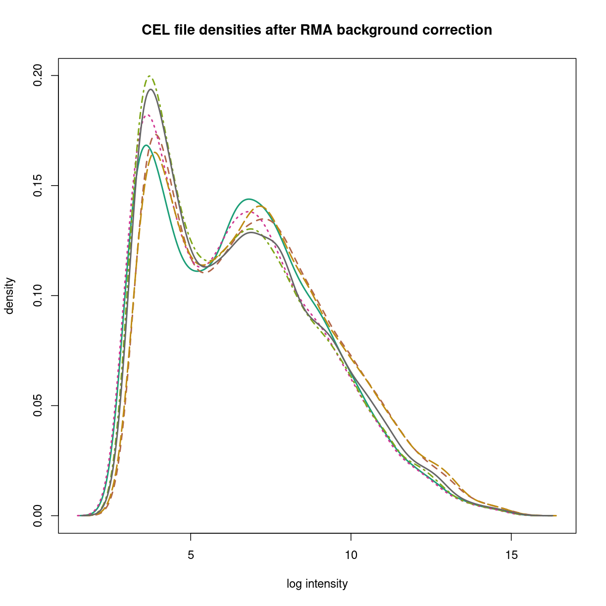

---
# Please do not edit this file directly; it is auto generated.
# Instead, please edit 05-DataNormalisation.md in _episodes_rmd/
title: "Microarray Data processing with RMA"
teaching: 20
source: Rmd
exercises: 20
questions: 
- "How do we perform processing of microarray data in R?"
- "How do we perform processing and summarisation of Affymetrix microarray data in R?"
objectives:
  - "Understand and explain Background correct, normalise and summarisation steps for microarray
  data" 
  - "Be able to use rma or gcrma packages for microarray data processing"
keypoints:
    - "RMA, the most widely used processing algorithm for Affymetrix data, is implemented in R using the `rma()`
    function in the `affy` package."
    - "The steps of background correction, quantile normalisation, and summarisation are performed
    in order to obtain feature-level data"  
---

### The processes of RMA

The RMA algorithm performs steps of data processing discussed in class.

1. Background correction.
2. Normalisation.
3. Summarisation (calculating feature-level data)

These steps are performed in order, and yield a processed data set size that is
considerably smallar than the data set prior to processing. While the starting object is an AffyBatch object, the result is an ExpressionSet.
`

## Plotting the signal densities from raw CEL files

The `plotDensity` and `plotDensity.AffyBatch` functions from the `affy` package show the signal densities of data from each sample in overlaid line plots. The `plotDensity` function works on matrices, while the `plotDensity.AffyBatch` function works of AffyBatch data and log transforms the signal intensities prior to plotting.

As you can see, each sample does look like it comes from a similar kind of distribution for all six CEL files, but the distributions clearly differ. The prcessing steps of RMA address these issues to provide estimates for each feaature (transcript).

## The need for background correction

Microarray data contains ubiquitous background noise, so an
important first task is removal of background noise. Different
algorithms deal with background differently. Most Affymetrix expression microarrays are
designed with *probe pairs*, where one probe is a *perfect match* (PM) to the target and
one is a single base *mismatch* (MM) to the target. Methods like Affymetrix's own MAS5
algorithm use the difference between PM and MM hybridisation to addreess background noise.
The RMA algorithm ignores the MM probes, and so must address background correction
directly as a property of hybridisation. 

The RMA model is to model the perfect match (PM) signal as a sum of the real signal for probe $$j$$, from probeset $$k$$, on array $$i$$.

$$
\text{PM}_{ijk} = \text{bg}_{ijk} + s_{ijk}
$$

The key part of the model is to assume that the true signal  is drawn from an exponential distribution

$$s_{ijk} \sim \text{Exp}(\lambda_{ijk})$$

while the background component (both optical noise and non-specific hybridisation) is drawn from a normal distribution that depends only on the array:

$$\text{bg}_{ijk} \sim \mathcal{N}(\beta_i,\sigma^2_i)$$

The background removal step of RMA estimates and removes this second component. 

The *gcrma* algorithm differs from *rma* in assuming the background also depends on the GC content of the probes.

## The need for normalisation

Sample normalisation in RMA is performed via quantile normalisation of the probe level data, as discussed in class. This allows samples to be compared to each other assuming the data arise from the
same parent distribution.

 Quantile normalisation puts the data on a common empirical distribution.

## Summarisation: from probe-level to feature-level data. 

The summarisation step reduces the size of the data for each sample to the number of
measured transcripts (or genes, or exons, depending on the array). These are referred to as "features", or "probesets", and the resulting ExpressionSet is "feature-level" data.
The summarisation step in rma is performed for each probe-set over all background-corrected, quantile-normalised samples using the median polish algorithm.

## Performing RMA in R

Performing RMA  in R is relatively straightforward as it has been implemented
in the `affy` package. The function, `rma()` takes in an **AffyBatch** object, which we
have previously created when reading in our CEL files. Hence, the following one line of
code performs RMA normalisation, and returns an ExpressionSet object containing the
background corrected, normalised, and summarised expression data. 

~~~
eset <- rma(affydata)
~~~
{: .language-r}

~~~
Background correcting
Normalizing
Calculating Expression
~~~
{: .output}

~~~
plotDensity(exprs(eset),xlab='log intensity',main="feature level densities after RMA",lwd=2)
~~~
{: .language-r}

> ## Try it
> If you get help on `rma()` using either `help(rma)` or `?rma`, you can see how to run
> the same process without background correction or normalisation. **Try it!**
{: .challenge}

## Manipulating an ExpressionSet object

Earlier, we have alluded to the data contained in an **ExpressionSet** object. We can
access each of these pieces of data using the following functions:

|-----------------|----------------------------|--------------------|
| Data            | Type of information        | Function           |
|-----------------|----------------------------|--------------------|
| Annotation      | Chip information           | `annotation()`     |
| PhenoData       | Phenotype data             | `pData()`          |
| Expression      | Normalised gene expression | `exprs()`          |
| Experiment data | Experimental information   | `experimentData()` |
| Feature data    | Probeset data              | `featureData()`    |

The phenotype data for each of the samples are retained after rma, so you should be able to see that information 

~~~
pData(eset)
~~~
{: .language-r}

~~~
          culture
GSM820817    MEGM
GSM820818    MEGM
GSM820819    MEGM
GSM820820    SCGM
GSM820821    SCGM
GSM820822    SCGM
~~~
{: .output}

You can also try, running RMA *without* background correction, or without quantile normalisation, and plot the densities.



