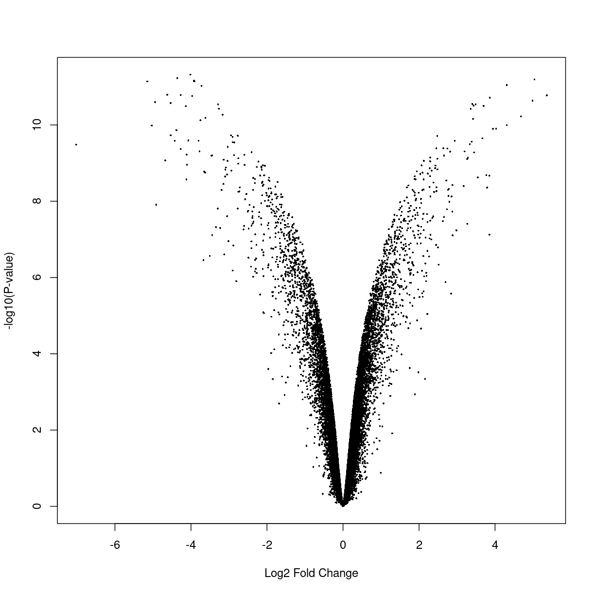
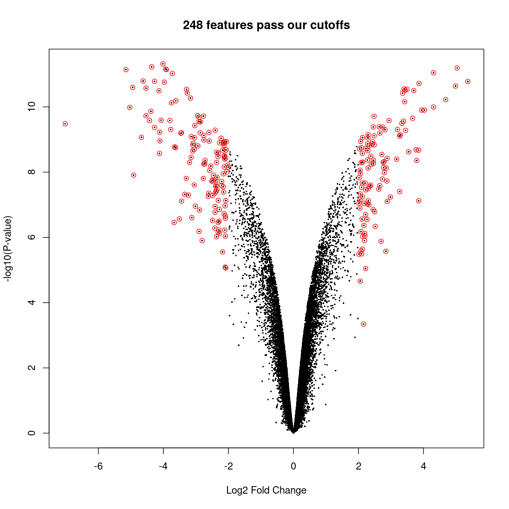
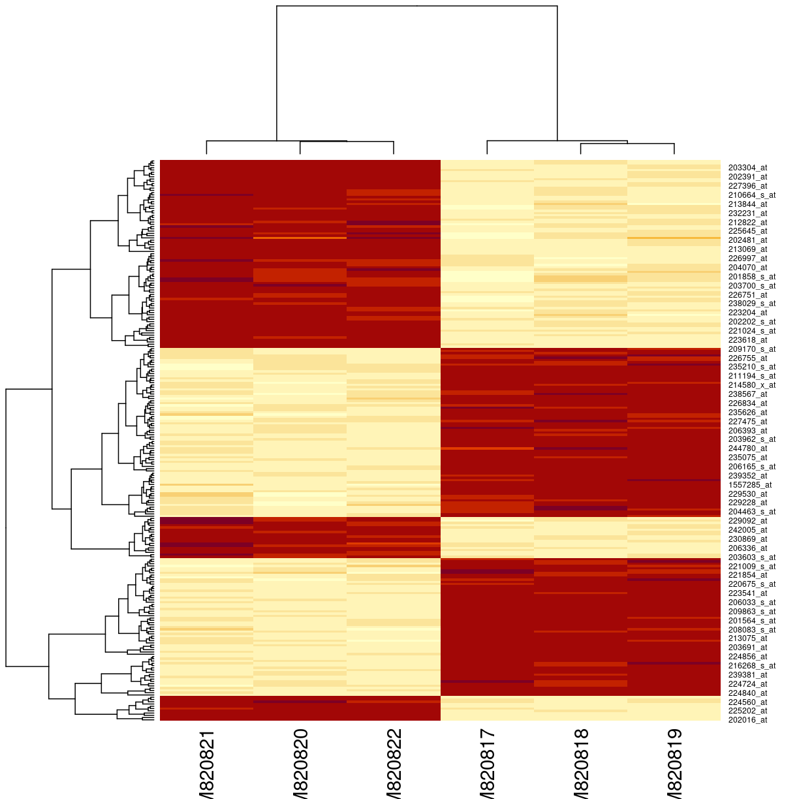
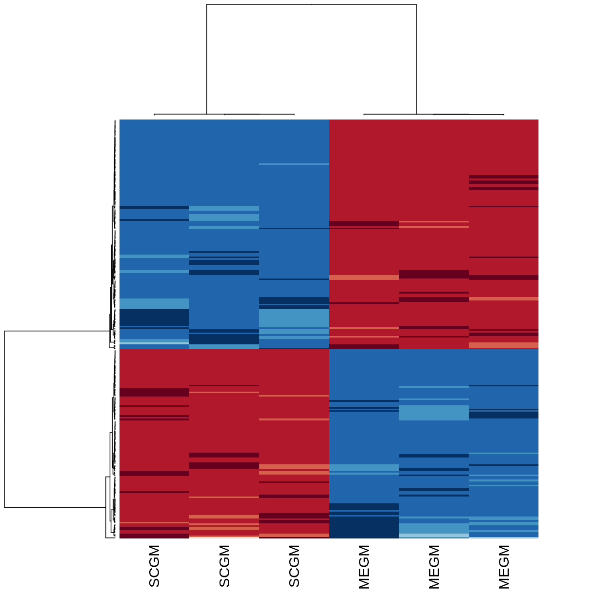

---
# Please do not edit this file directly; it is auto generated.
# Instead, please edit 08-downstreamAnalysis.md in _episodes_rmd/
title: "Basic downstream analysis of microarray data"
source: Rmd
teaching: 10
exercises: 10
questions: 
- "What can we do to interpret the data from our differential expression analysis?"
objectives:
- "Be able to plot volcano plots and heatmaps in R." 
- "Be able to interpret the above plots generated."
- "Be aware of some downstream analysis that are commonly done to interpret the results of differential expression analysis." 

keypoints: 
- "Volcano plots can be used to infer relationships between fold changes and statstical confidence."
- "Heatmaps can be used to visualize distinct trends in gene expression patterns between different experimental conditions by clustering."
---

## Downstream analysis of microarray data

So far in our analysis, we have obtained a list of differentially expressed genes. However, having a list of genes is not usually the most informative. Here, we will discuss some plots that are commonly used to visualize the results of differential gene expression analysis. We will also discuss (but not go through their implementation) some commonly employed strategies to interpret the results of differential gene expression analysis. 

## Volcano plots 

A volcano plot is a helpful visualization that shows the log fold-change versus the negative log p-value. Usually, we will expect that genes larger absolute fold changes will have larger negative log p-values and hence implying greater statistical confidence. 

A volcano plot of a fitted model is as simples as

~~~
volcanoplot(fitted.ebayes)
~~~
{: .language-r}

But we can use some R features to highlight the points with cutoffs of interest. Let's decide the interesting genes are those with $$|\log_2(\text{fold change})| \ge 2$$ and adjusted $$p < 0.05$$, thus:

~~~
interesting_genes <- topTable(fitted.ebayes,number=Inf,p.value = 0.05,lfc=2)
volcanoplot(fitted.ebayes, main=sprintf("%d features pass our cutoffs",nrow(interesting_genes)))
points(interesting_genes[['logFC']],-log10(interesting_genes[['P.Value']]),col='red')
~~~
{: .language-r}

From the plot above, we can see that many genes tend to show small but statistically insignificant changes in expression level between the two conditions. On the other hand, a small subset of the genes show very large fold changes with relatively small p-values. These "interesting" genes tend to be further analyzed for their potential role in the biological phenomenon of interest. 

## Heatmaps 

Heatmaps are among the most widely used plots for expression data matrices of expression data.The idea is to draw a false colour image of a data matrix (typically red is "hot" or high expression), and to use a clustering algorithm to sort the rows (features) and columns (samples) to highlight natural groupings of the data.

> ## Choosing the genes of interest for analysis. 
>
> How do we choose which genes we should be included in our heatmap? Ideally, we will have
> all the differentially expressed genes on it. However, in some cases, that is may not be feasible
> (especilly if there are simply too many).
> Another strategy might be to use genes that show the most variance, as it is
> most likely that we can use these highly variable genes to cluster our samples into
> distinct groups. Finally, we can visualize simply the top most significantly expressed
> genes, which we will do here.
{: .callout}

For simplicity, we will visualize the expression of features that pass our cutoffs. To do so, we will need the following: 

1. The list of all the probesets most differentially expressed between our experimental condition, and;
2. Their normalized expression value. 

Let's use the genes that passed our previous cutoffs and create a dataset of just those genes

~~~
eset_of_interest <- eset[rownames(interesting_genes),]
heatmap(exprs(eset_of_interest))
~~~
{: .language-r}

The `heatmap()` function does a lot of work. The denodrograms on the top and the left represent the ordering of rows and columns. This is done using a distance calculation, by default Euclidian distance. It doesn't seem quite right, because we only have two groups of genes: they should either be up or down in each group.

We can make a few changes to fix and beautify the  heatmap. The most useful is to use *correlation*, rather than euclidean distance, for the clustering. The function requires a distance as input, so we'll use `1 - correlation`.  We can also change the colours, label the samples according to culture conditions, and remove the gene labels.

~~~
library(RColorBrewer)
eset_of_interest <- eset[rownames(interesting_genes),]
heatmap(exprs(eset_of_interest),
        labCol=eset$culture,labRow=NA,
        col       = rev(brewer.pal(10, "RdBu")),
        distfun   = function(x) as.dist(1-cor(t(x))))
~~~
{: .language-r}

## What's next?

Although we have discussed the volcano plot and heatmaps, there are numerous avenues for downstream analysis. For instance, one commonly used analysis toolkit is the gene set enrichment analysis (GSEA) where we test for whether particular sets of genes are enriched in our list of differentially expressed genes. Ultimately, what downstream analysis is performed is dependent on the question that one wishes to address. New analysis methods are constantly being developed by others, and hence it is important for one to keep abreast on these developments in order to get the most out of our analysis. 


