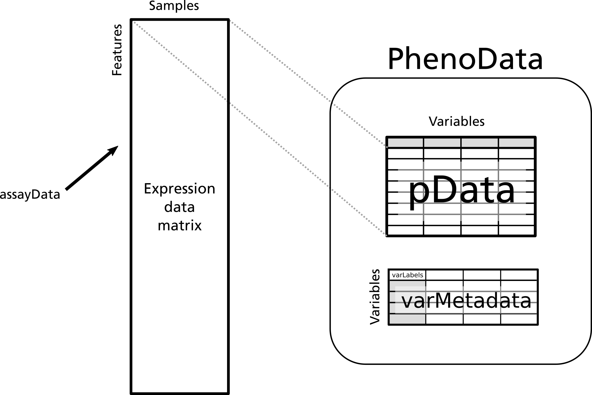
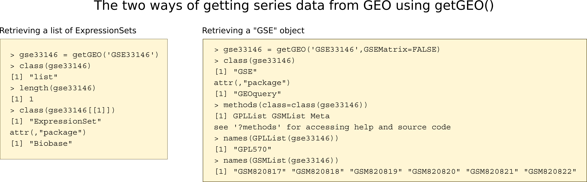

```{r setup, include=FALSE}
knitr::opts_chunk$set(echo = TRUE)
source("../bin/chunk-options.R")
.starting_image <- ".01-RData"
.starting_static <- ".02-static-RData"
.closing_image <- ".02-RData"
if(file.exists(.starting_image)) {
    load(.starting_image)
    }
if(file.exists(.starting_static)) {
    load(.starting_static)
    }
library(GEOquery)
```

In the class, we learned how the basic requirements of a complete data object for gene expression
microarray studies consists of a tall, skinny matrix (for the experimental measurements) and a
short, wide table (to describe the experiment). The Bioconductor class for this type of data is an
`ExpressionSet`. 

In this lesson we will be creating these objects in R from data available at GEO.

## The ExpressionSet class 

The ExpressionSet class of objects are commonly used to store microarray experiment data. A typical ExpressionSet class object contains the following data: 

assayData
: raw or processed intensities, where each row corresponds to one probe and each column corresponds to one sample

phenoData
: experimental meta-data, where each row corresponds to one sample.

featureData
: This is optional annotation of the features (e.g., genes or transcripts) measured in an experiment.

annotation
: a character vector specifying the platform name 




> ## The first data set
> 
> Data for this lesson is taken from GEO (accession ID: [GSE33146][GSE33146]).
> The experiment was on a cancer cell line grown in culture.
> Cells are grown in either MEGM (where they retain an epithelial phenotype) or SCGM
> (where they undergo reversible epithelial-mesencymal transition, or EMT). Gene 
> expression analysis using the [hgu133plus2][hgu133plus2] microarray was performed to identify genes
> associated with the EMT process.
{: .callout}

## Getting processed data from GEO into R

Before any analysis, we need to get the data into R. If you navigate to [GSE33146][GSE33146], you will see that several different file formats are available for download. 

> ## The GEO file types
>
> [SOFT][SOFT] files
> : The SOFT file format is commonly used by submitters to GEO. It contains a lot of information
>  about the experiment (MIAME compliance), and also contains the estimates for each gene or transcript, in a custom defined file format.
>
> [MINiML][MINIML] file
> : The MINiML file format uses XML, a computer-readable markup language. This has the same information 
>  as SOFT, but in a different format.
>
> Series matrix file
> : The matrix file is meant to be readable directly into a spreadsheet.
>  Generally these files don't have all the information provided by SOFT, but are easy to work with.
>
> Supplemental files
> : The `.CEL` files have the original, unprocessed data. 
>  Since we want to process it ourselves, that's what we'll need.
{: .checklist}

## Download the files or query them directly using GEOquery

The GEOquery package (definitely try `browseVignettes('GEOquery')`) provides tools for reading files directly from GEO based on the accession.
GEOquery works for different kinds of GEO data, including Samples (GSM), platforms (GPL), data sets, (GDS), and series (GSE). 

> ## These data appear complicated.
>
> GEOquery, like other Biconductor packages, creates data objects that seem somewhat complicated.
> If you are used to simple R lists, vectors, and data frames, the data structures may seem
> overwhelming. Keep in mind that these data stuctures, regardless of how complicated they are, are
> basically compositions of data structures you already know: lists, vectors, matrices, and data
> frames.
{: .callout}

## Getting a single GSM object for a single sample

We can create a single GSM object of a single sample with a call to getGEO (I'm using an example from the same GSE).

```{r GSMGet, eval=TRUE}
library(GEOquery)
gsm <- getGEO('GSM820817')
```

```{r}
## What methods are available to call on this class of data?
methods(class=class(gsm))
## The Table method shows the estimates
head(Table(gsm))
## The Meta method shows the experimental design, etc.
head(Meta(gsm))
```
As you can see, the `Table` method returns numeric estimates for each probe (which is what we will eventually get after pre-processing), while the `Meta` method gives us information about our experiment.

> ## Why does this GSM appear in *two* series?
>
> One of the `Meta()` entries shows that the sample from GSE33146 actual belongs to
> *two* series. What is the difference between them? 
>
> > ## Solution
> >
> > ```{r}
> > Meta(gsm)[['series_id']]
> > ```
> > Look up GSE33167 on the GEO web site.
> > The series GSE33167 is a *super-series* composed of two series: the one we are looking at and another series comparing baseline expression among triple-negative breast cancer cell lines.
> {: .solution}
>
{: .challenge}


## Retrieving the whole GSE as a list of ExpressionSets

The function `getGEO()` with a GSE identifier as a sole argument will download the series matrix files from GEO and return them as a _list of ExpressionSet objects_. In many cases, there will only be one experiment for a series, so the list will contain a single ExpressionSet, which can be retrieved as the first member of the list.

```{r getGEO, eval=TRUE}
library(GEOquery)
gse33146 <- getGEO('GSE33146')
length(gse33146)
class(gse33146[[1]])
gse33146 <- gse33146[[1]]
```

### Retrieving the whole GSE by parsing the SOFT file

When `getGEO()` is run with the named argument `GSEMatrix=FALSE`, it does not parse the Series Matrix files but does parse the SOFT files. The advantage of this method is that the SOFT files may contain more information than the series matrix files, but a disadvantage is that it is much slower and the resulting object is _not_ a list of ExpressionSets. However, parsing the Series Matrix can also introduce errors; parsing the SOFT file is less error-prone.

The GSE is the most complicated object retrieved by getGEO, because a series is composed of sample (GSM) and platform (GPL) objects.  Each is accessed by a *list*: `GSMList` and `GPLList`. You can download the whole series into an R object by accession, but you can also download the file outside of R and read it in as a local file.

```{r noGSEMatrix, eval=FALSE}
library(GEOquery)
## if we have a good connection to the internet, we can download it directly from GEO
gse2 <- getGEO('GSE33146',GSEMatrix=FALSE)
# If it's available on a local file system, we can read the file directly
##gse2 <- getGEO(filename='data/GSE33146_family.soft')
names(GSMList(gse2))
```

> ## Using the processed data from a GSE or GDS as an R ExpressionSet
> 
> For a GEO Data Set (GDS) The GEOquery package provides a function `GDS2eSet` to converta a GDS directly to an ExpressionSet
> object. This function uses the *processed* data available on GEO, not the raw data.
> 
> There is no corresponding `GSE2eSet` function because a single GEO Series can contain data from multiple
> platforms, and an ExpressionSet object is data from one platform.
{: .callout} 




> ## Get the second data set
>
> Our second data set contains 12 samples, and is found in [GSE66417][GSE66417]. Retrieve the processed data into an ExpressionSet object.
>
> > ## Solution
> >
> > ```{r gse66417}
> > gse66417 <- getGEO('GSE66417') 
> > length(gse66417) # this should be a list of length 1
> > gse66417 <- gse66417[[1]]
> > ```
> {: .solution}
>
{: .challenge}

```{r closeout, include=FALSE}
save(list=ls(),file=.closing_image)
```

 
 
